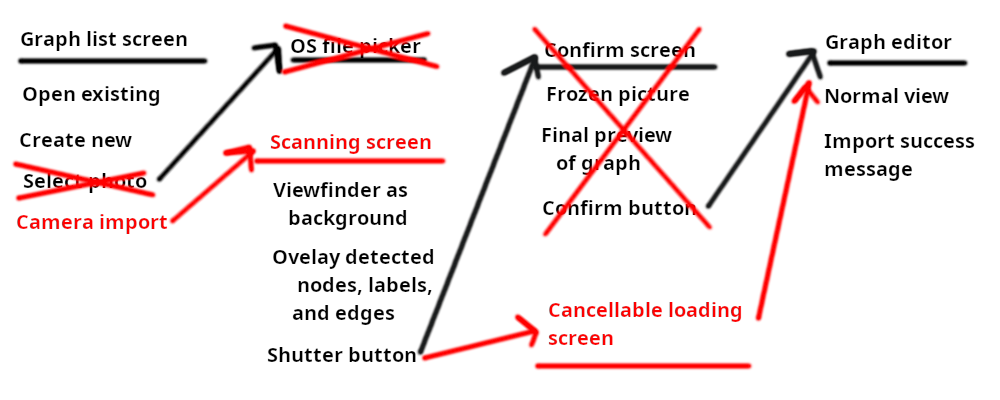

# SEG4105-A02 Lab 3

|Name|Student Number|
|---|---|
|Daniel Tang|0300068985|

## High-level description

The feature is title "Camera graph import." Our client has a lot of hand-drawn Mikados graphs on paper and appreciated it when I manually digitized him one into our Mikado method webapp. Other people may have similar graphs or flowcharts we can try to import. This will reduce friction to onboard more users.

To do this, we can use text and shape recognition AI fed from the phone's camera. Those will be combined to find the types of nodes, edges, labels, and completion statuses that best-effort approximate the user's intent. This is mainly for saving the user some time and messy handwriting is expected to be fixable later.

# Breadboarding

