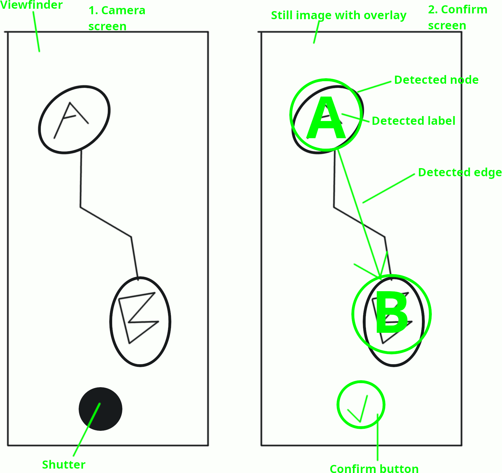

# SEG4105-A02 Lab 4

|Name|Student Number|
|---|---|
|Daniel Tang|0300068985|

## High-level description

The feature is titled "Camera graph import."
Our client has a lot of hand-drawn Mikados graphs on paper and appreciated it when I manually digitized him one into our Mikado method webapp.
Other people may have similar graphs or flowcharts we can try to import.
This will reduce friction to onboard more users.
This customer is a good fit for the product because he is our main customer.
The baseline is the current manual digitization method, measured by the amount of the customer's and our time spent and the number of complaints, both of which should be decreased.

Our appetite is the 6-week cycle for deliverable 3.
In that time, the development of this feature must not take up time we want for other classes, especially around midterms and exams.
I also do not have even a 0 day appetite for researching or debugging vision algorithms, needing to focus my studying effort on other courses.
I am willing to spend a maximum of 6 hours per week on this feature, aiming for 3 hours.
We will stop after getting the client's provided drawings to import when scanned on a clean background without any tilt, and leave this only a nice-to-have feature for other customers for this sprint.

One rabbit hole is customizing the vision algorithm and not leaving it as the off-the-shelf defaults.
That would have lead to an investigation of one setting after another, then a research of complicated concepts.

Another rabbit hole is trying to tell the shapes apart from the labels.
An arrowhead or a line is hard to tell apart from a "V" or an "l."
To avoid having to solve this problem, we just set a minimum size for each, with the shapes bigger than the labels, and have the user discover this while experimenting.

# Fat markers

