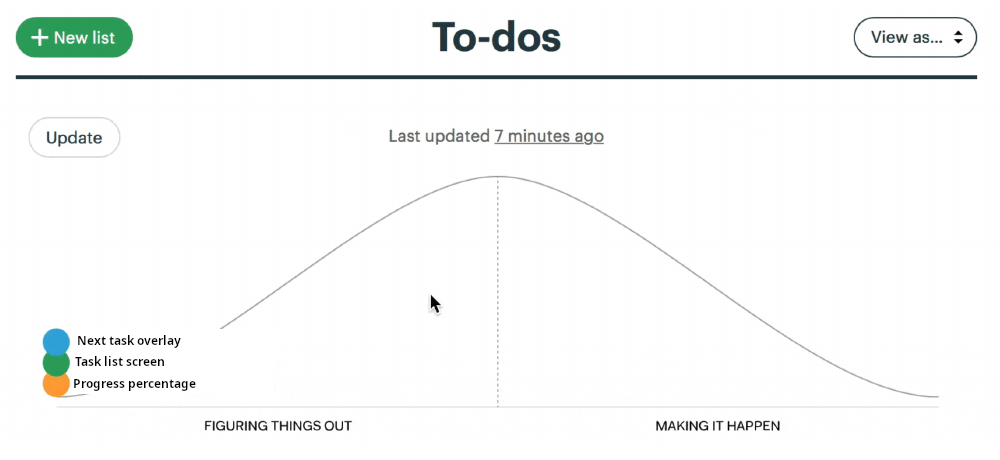
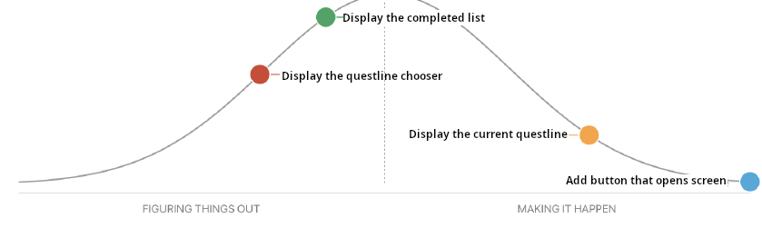
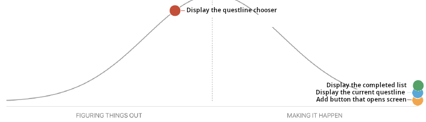

# SEG4105-A02 Lab 6

|Name|Student Number|
|---|---|
|Daniel Tang|0300068985|

## Start mapping your scopes

Scopes:

- Scope 1: Next task overlay
- Scope 2: Task list screen
  - Details: showing completed tasks, and all possible questlines
- Scope 3: Progress percentage

## Detailed

Chose "Scope 2: Task list screen":

- Add button that opens screen
- Sort tasks into complete, blocked, and ready
- Choose one ready task for each questline
- Display the completed list
- Display the current questline
- Display the questline chooser

## Hill charts

