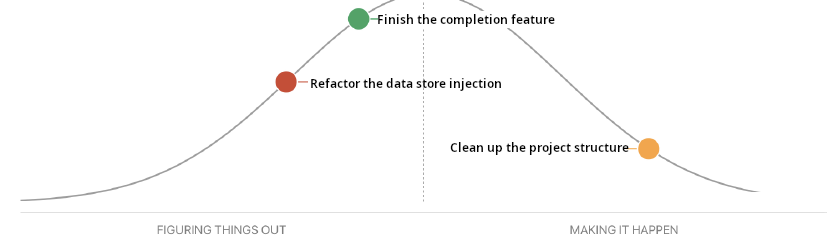
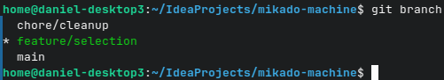

# SEG4105-A02 Lab 7

|Name|Student Number|
|---|---|
|Daniel Tang|0300068985|

## Summary

Yesterday (last week) I met with teammates to discuss the state of the project, and reviewed documentation on outstanding features we need to close first. Today (this week) I will implement and clean up the project so that it is ready for our planned feature. I am blocked on me finishing the existing work.

## Hill Chart

## Pull request summary

Pending pull requests are not ready to be pushed yet. Here is a screenshot of my local branches instead:

