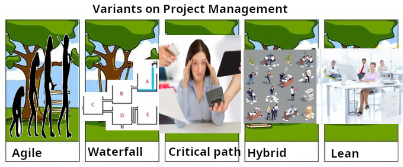

# SEG4105-A02 Tutorial 1

|Name|Student Number|
|---|---|
|Daniel Tang|0300068985|

## Drawing

## Research

### Later Brainstorming Notes

- Agile is incrementally evolving the product
- Waterfall is supposed to be step by step, but most of the time it's not as expected and the water fails to reach the goal
- Critical path only focus on the steps that (eventually after recursion) hold the final deadline back, and increases effort on them
- Hybrid just mixes the best of a bunch of different approaches
- Lean cleans away the unnecessary steps and their costs

### Sources

- Lecture 03_SEG4105_ShapeUp
- Lecture 04_SEG4105_WaterfallRoyce
- https://www.planview.com/resources/guide/agile-methodologies-a-beginners-guide/benefits-agile/
- https://www.lucidchart.com/blog/pros-and-cons-of-waterfall-methodology
- https://asana.com/resources/fast-tracking-vs-crashing
- https://www.wrike.com/blog/what-hybrid-project-management/
- https://asq.org/quality-resources/six-sigma

### Images

- https://knowyourmeme.com/photos/475749-tree-swing-cartoon-parodies
- https://www.popsci.com/science/article/2013-05/did-rock-climbing-help-us-start-walking-upright/
- https://www.fresherslive.com/latest/articles/water-tank-brain-teaser-which-tank-will-fill-up-first-10028902
- https://hrdailyadvisor.blr.com/2017/03/06/job-deadlines-reason-youre-stressed/
- https://www.vecteezy.com/vector-art/7681855-disorganized-office-work-set
- https://www.myhrtoolkit.com/blog/office-efficiency-ideas

## Early Brainstorming

- Ideas and some topic headings but NO COPIED TEXT from ~/.local/share/nomic.ai/GPT4All/llama-2-7b-chat.ggmlv3.q4_0.bin , [./brainstorming_llama.txt]
